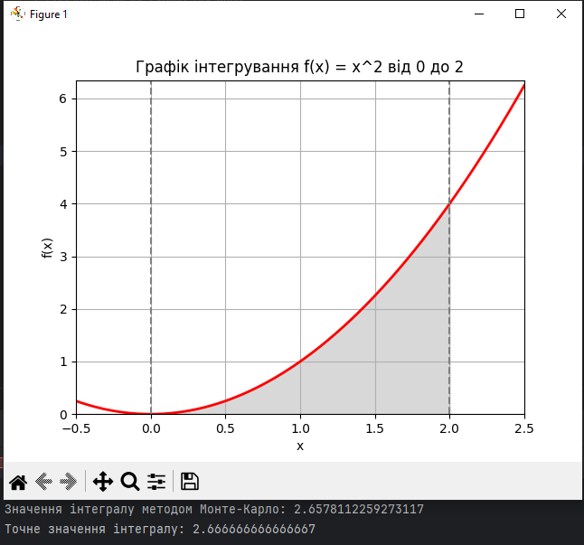

# goit-algo-hw-10

# Завдання 1

Задача: максимізувати виробництво продуктів: "Лимонад" і "Фруктовий сік"

<h3>Умови завдання:</h3>

"Лимонад" виготовляється з "Води", "Цукру" та "Лимонного соку".
"Фруктовий сік" виготовляється з "Фруктового пюре" та "Води".

<h3>Обмеження ресурсів:</h3>

- 100 од. "Води"
- 50 од. "Цукру"
- 30 од. "Лимонного соку"
- 40 од. "Фруктового пюре".

Виробництво одиниці "Лимонаду" вимагає 2 од. "Води", 1 од. "Цукру" та 1 од. "Лимонного соку".
Виробництво одиниці "Фруктового соку" вимагає 2 од. "Фруктового пюре" та 1 од. "Води".

Використовуючи PuLP створено модель для розв'язання проблеми максимізації загальної кількості продуктів, які можна
виготувати згідно з вищезазначеними умовами.

<h3>Результат:</h3>

- Total Production: 50.0
- Lemonade Production: 30.0
- Fruit Juice Production: 20.0

<h3>Використання:</h3>

- 30 лмнд = 30 * (1 цукор + 2вода + 1 лим.сік) = 30 цукор + 60 вода + 30 лим.сік
- 20 фр.сік = 20 * (2 фр.пюре + 1вода) = 40 фр.пюре + 20 вода

<h3>Залишки:</h3>

- "Води" 100 - (60 + 20) = 20
- "Цукру" 50 - 30 = 20
- "Лимонного соку" 30 - 30 = 0
- "Фруктового пюре" 40 - 40 = 0

# Завдання 2

- обчисліть значення інтеграла функції за допомогою методу Монте-Карло, інакше кажучи, знайдіть площу під цим графіком (
  сіра зона).
- перевірте правильність розрахунків, щоб підтвердити точність методу Монте-Карло, шляхом порівняння отриманого
  результату
  та аналітичних розрахунків або результату виконання функції quad. Зробіть висновки.

<h3>Висновки:</h3>

- метод Монте-Карло допомає робити розрахунки для задач, які важко (чи навіть не можливо) зробити звичайними методами
- цей метод дуже ефективний у випадках, коли прямі обчислення надто складні або ресурсоємні
- точність результату при використанні методу Монте-Карло залежить від кількості випадкових чисел, які були використані
  під час роботи алгоритму (чим більше цих чисел - тим більше точність)
- результат виконання поточної задачі дуже близький до розрахунків за допомогою методу quad з бібліотеки scipy.integrate 